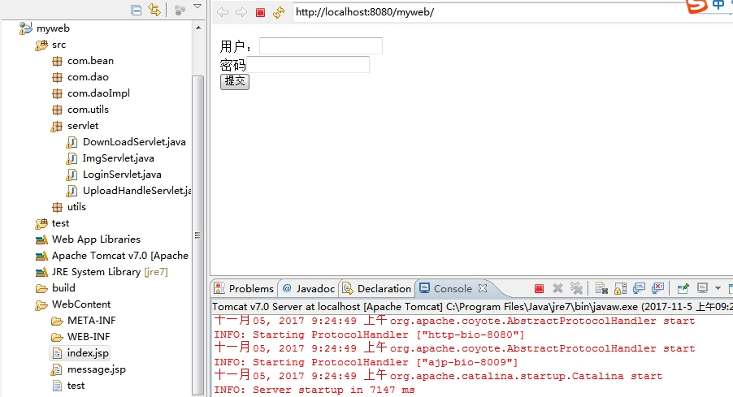
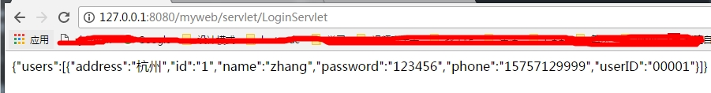
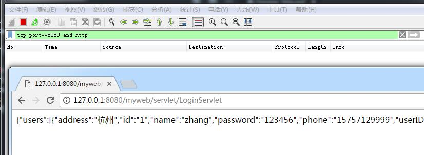
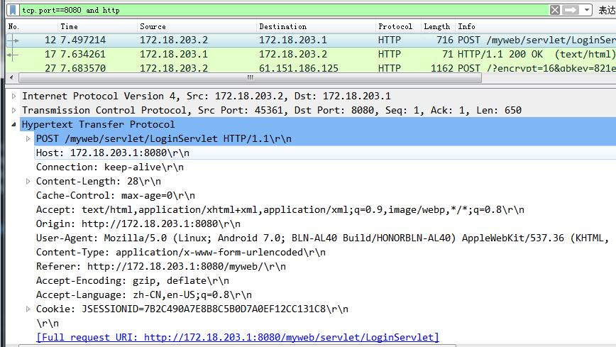
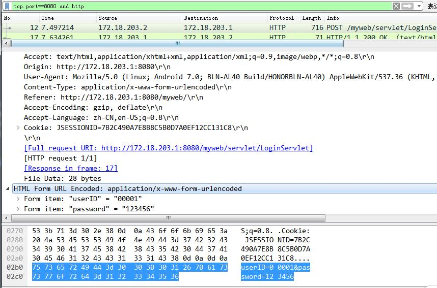
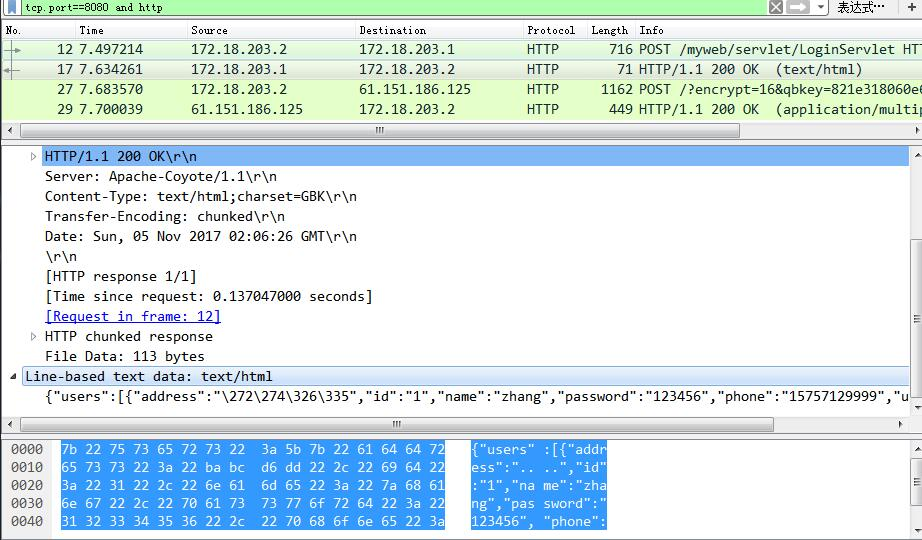

http 抓包实验
===


---

本地server ：
* eclipse 开发的简单的java web项目
* 服务器用的本地的tomcat7
* 数据库用的mysql
* 不使用java web的矿建，直接用servlet类处理逻辑（简单的get,post请求）

运行如下：



本地浏览器访问




功能如下：

客户端：
```
<form action="<%=basePath%>servlet/LoginServlet" method="post">
  用户：<input type="text" name="userID"><br/>
  密码:<input type="text" name="password"><br/>
  <input type="submit" value="提交">
  </form>
```

服务端

```
String userID = request.getParameter("userID");
String password = request.getParameter("password");
		
UserDao userDao = new UserDaoImpl();
User user = userDao.user_getByUserIDAndPassword(userID, password);
if(user == null) 
    out.print("0"); // 用户不存在返回 字符 0
else{
    List<User> list = new ArrayList<User>();
    list.add(user);
    String s = new JSonUtil().listToJson2(list, "users");
    out.print(s); // 用户存在 返回用户对象json字符串 这里处理成jsonstr 方面前台jquery处理
}

```

=====

#### 本地浏览区使用localhost/127.0.0.1 ，wirkshark无法俘获相关的报文



wirkshark俘获不了数据，实践说明数据上述访问没有走本地网卡

* wirkshark

wirkshark软件是可以捕获网卡数据的，需要自己设置选项俘获哪一个网络设备接口（网卡，虚拟机网卡等）； 显然如果网卡中没有任何数据交换，wirkshark肯定是俘获不了任何数据的

* localhost/127.0.0.1(本地ip)

ping 127.0.0.1 和 ping本机 同样是不经过网卡的，都是环回驱动处理掉的

本地web server, 还是用localhost 和 127.0.0.1是不经过网卡的


也有如下说：

```
localhost是不经过网卡传输的，它不受网络防火墙和网卡相关的限制。127.0.0.1是通过网卡传输的，依赖网卡，并受到网络防火墙和网卡相关的限制。一般设置程序时，本地服务用localhost是最好的，localhost不会解析成ip，也不会占用网卡，网络资源。
```

#### 使用另外一台设备访问，数据通过网卡，wirkshark可以俘获到数据




* post 请求报文




数据部分如下： 占用了28字节，所以http post的 Content-Length是28

```
userID=00001&password=123456
```

* 响应报文

